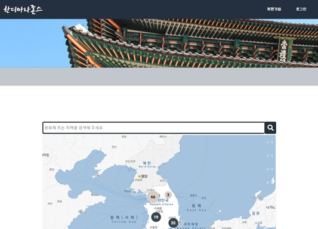
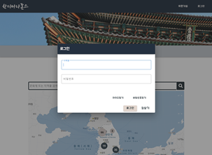
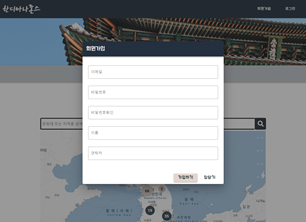
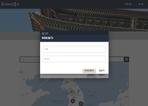
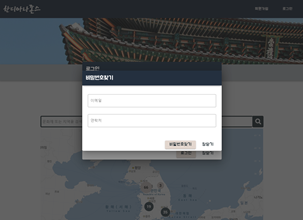
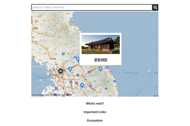
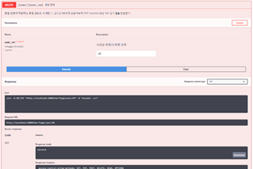
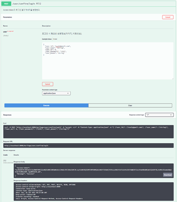
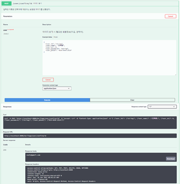

# 서울 2반 7팀 Sub PJT II: 한디아나존스 README

`우리나라 약 1,7000개에 달하는 방대한 문화재를 웹 페이지의 지도 위에서 모두 탐방해 나갈 수 있는 역사 교육 & 문화재 데이터 관리 및 사용방안 제고 & 온라인 관광사업 활성화 목적의 웹페이지 입니다.`

`개발환경`

- Vue.js / Sts 3.9.14 / MySQL

## 프로젝트 선정 배경

### 저조한 역사 인식 수준


- 한국의 초, 중, 고등학교 학생 및 대학교 학생들은 대부분 한국사를 암기위주로 공부해 휘발성 지식에 가깝다.
- 더불어 한국 학생들의 전반적인 역사 인식 수준이 매우 낮은 것으로 나타났다.
- 때문에 사람들이 한국 역사를 재미있게 학습해 나갈 수 있도록 프로젝트를 기획했다.

### 데이터 시대 속 문화재 데이터 관리와 활용법 향상


- 4차산업 시대가 도래해 데이터의 양이 방대해지고 그 중요성이 커지고 있는 요즘, 쌓여만 가는 문화재 데이터를 효율적으로 활용할 수 있는 방안이 부재
- 프로젝트를 진행하면서 데이터베이스에 문화재 데이터를 필요한 값만 추출해 효율적으로 저장 관리하고, 이를 바탕으로 지도 위에서 한국 문화재를 탐방해 나갈 수 있게끔 활용방안 제시

### 코로나로 인해 치명타를 입은 관광사업의 온라인 시장 진출 방안 제시


- 코로나로 인해 오프라인 사업 중 대표적 사업인 관광사업이 치명타를 입음
- 온라인 상에서 한국 문화재를 탐방하며 관광을 할 수 있게끔 대안을 제시 - 추후 지역 상점들과 연결하여 온라인 상품 구매가 가능하도록 응용도 가능


## 협업 툴 준비 및 세팅

###### Jira


- Jira를 생성하고 기능 명세서를 중심으로 `Sub PJT II`  동안 수행할 작업 목록을 생성했다.
- Spirnt를 이용해 할일, 작업중인 일, 완료한 일을 체계적으로 정리하며 작업을 수행했다.
- 이후 팀 프로젝트 Gitlab을 MM에 연동하고 Jira도 연동을 완료했다. - Jira와 Gitlab에서 작업이 일어나면 알림이 MM으로 Push 되는 것을 확인할 수 있었다.

## Sub PJT II 기간 동안 수행한 내용

### 문화재청 제공 문화재 정보 데이터 로드

- [문화재청 문화재 Open API 주소](https://www.cha.go.kr/html/HtmlPage.do?pg=/publicinfo/pbinfo3_0201.jsp&mn=NS_04_04_02)

###### 홈페이지 데이터 설명서 확인


- 문화재 정보 Open API 요청을 위한 기본 url 정보와 그 외 요청 파라미터 값들을 확인한다.

- 우선 전체 페이지 조회를 위한 'pageUnit'과 'pageIndex' 파라미터 외에 필요한 파라미터 정보들은 홈페이지의 `활용정보`에서 확인할 수 있다.

- 데이터를 받아오기 위한 코드를 짜기 전, 전체 파라미터 사용법과 전체 데이터의 양을 확인하기 위해 웹상에서 요청파라미터 인자들을 넣어 데이터를 html 형식으로 확인해 봤다.

  - 파라미터를 넣은 검색주소: http://www.cha.go.kr/cha/SearchKindOpenapiList.do?pageUnit=900&pageIndex=18
  - 페이지 하나동 조회 정보의 개수를 900으로 놓고 18페이지를 조회하면 가장 마지막 데이터인 16054번째의 데이터를 확인할 수 있다.

  

###### 작업수행을 위한 기본 라이브러리 활용법

```python
import requests
from bs4 import BeautifulSoup as bs
import xml.etree.ElementTree as ET
from xml.etree.ElementTree import Element, dump, ElementTree
```

- `requests`: **Requests** allows you to send HTTP/1.1 requests extremely easily. There’s no need to manually add query strings to your URLs, or to form-encode your POST data. Keep-alive and HTTP connection pooling are 100% automatic, thanks to [urllib3](https://github.com/urllib3/urllib3).

  - ```python
    # 사용예시
    >>> r = requests.get('https://api.github.com/user', auth=('user', 'pass'))
    >>> r.status_code
    200
    >>> r.headers['content-type']
    'application/json; charset=utf8'
    >>> r.encoding
    'utf-8'
    >>> r.text
    '{"type":"User"...'
    >>> r.json()
    {'private_gists': 419, 'total_private_repos': 77, ...}
    ```

- `Beautiful Soup`:  Beautiful Soup is a Python library for pulling data out of HTML and XML files.

  - ```python
    # 사용예시
    import requests
    from bs4 import BeautifulSoup
    
    url = 'https://kin.naver.com/search/list.nhn?query=%ED%8C%8C%EC%9D%B4%EC%8D%AC'
    
    response = requests.get(url)
    
    if response.status_code == 200:
        html = response.text
        soup = BeautifulSoup(html, 'html.parser')
        print(soup)
    
    else : 
        print(response.status_code)
    ```

- `xml.etree.ElementTree`:  The [`xml.etree.ElementTree`](https://docs.python.org/3/library/xml.etree.elementtree.html#module-xml.etree.ElementTree) module implements a simple and efficient API for parsing and creating XML data.

  - ```python
    # 사용예시
    import xml.etree.ElementTree as ET
    tree = ET.parse('country_data.xml')
    root = tree.getroot()
    # Or directly from a string:
    root = ET.fromstring(country_data_as_string)
    ```

  - `Element.find`: [`Element.find()`](https://docs.python.org/3/library/xml.etree.elementtree.html#xml.etree.ElementTree.Element.find) finds the *first* child with a particular tag

  - `Element.text`: [`Element.text`](https://docs.python.org/3/library/xml.etree.elementtree.html#xml.etree.ElementTree.Element.text) accesses the element’s text content. [`Element.get()`](https://docs.python.org/3/library/xml.etree.elementtree.html#xml.etree.ElementTree.Element.get) accesses the element’s attributes

  - `ElementTree`: [`ElementTree`](https://docs.python.org/3/library/xml.etree.elementtree.html#xml.etree.ElementTree.ElementTree) provides a simple way to build XML documents and write them to files. The [`ElementTree.write()`](https://docs.python.org/3/library/xml.etree.elementtree.html#xml.etree.ElementTree.ElementTree.write) method serves this purpose.

  - `dump`: Writes an element tree or element structure to sys.stdout. This function should be used for debugging only.

  

###### 전체 목록 가져오기

```python
#전체 목록 가져오기
cnt = 1 # 진행상황 확인을 위한 cnt 선언
heritages = []
for page in range(1,18):
    url = "http://www.cha.go.kr/cha/SearchKindOpenapiList.do?pageUnit=1000&pageIndex=" + str(page)
    response = requests.get(url).content 
    soup = bs(response, 'html.parser') 
    doc = ET.fromstring(str(soup)) # object 형태로 데이터를 반환
    iter_elem = doc.iter(tag="item") # Creates a tree iterator with the current element as the root.
    for elem in iter_elem:
        # 파라미터 값에 접근할때 전부 소문자임을 주의
        heritage = {} # 딕셔너리에 키와 벨류 형태로 문화재 목록 정보를 담는다.
        heritage['sn'] = elem.find('sn').text
        heritage['no'] = elem.find('no').text
        heritage['ccmaname'] = elem.find('ccmaname').text
        heritage['crltsnonm'] = elem.find('crltsnonm').text
        heritage['ccbamnm1'] = elem.find('ccbamnm1').text
        heritage['ccbamnm2'] = elem.find('ccbamnm2').text
        heritage['ccbactcdnm'] = elem.find('ccbactcdnm').text
        heritage['ccsiname'] = elem.find('ccsiname').text
        heritage['ccbaadmin'] = elem.find('ccbaadmin').text
        heritage['ccbakdcd'] = elem.find('ccbakdcd').text
        heritage['ccbactcd'] = elem.find('ccbactcd').text
        heritage['ccbaasno'] = elem.find('ccbaasno').text
        heritage['ccbacncl'] = elem.find('ccbacncl').text
        heritage['ccbacpno'] = elem.find('ccbacpno').text
        heritage['longitude'] = elem.find('longitude').text
        heritage['latitude'] = elem.find('latitude').text
        heritages.append(heritage) # 문화재 1개의 필요 파라미터 값들을 모두 딕셔너리에 담는 것을 완료한 후, heritages 배열에 담아준다.
    if cnt % 1000 == 0:
        print(cnt)
    cnt+=1
    print(page, " 전체목록 완료")
```


###### 상세정보 가져오기


- 문화재검색 상세조회를 위한 필수 요청 파라미터들이다.

```python
#상세정보 가져오기

#7000개마다 연결 끊김
cnt=1 # 상세정보 가져오기 진행상황 확인을 위한 cnt 선언
for heritage in heritages[:7000]:
    # 문화재검색 상세조회를 위한 필수 요청 파라미터들을 url에 넣어 API 요청을 보낸다.
    url = "http://www.cha.go.kr/cha/SearchKindOpenapiDt.do?ccbaKdcd="+heritage['ccbakdcd']+"&ccbaCtcd="+heritage['ccbactcd']+"&ccbaAsno="+heritage['ccbaasno']
    response = requests.get(url).content
    soup = bs(response, 'html.parser')
    doc = ET.fromstring(str(soup))
    iter_elem = doc.iter(tag="item")
    for elem in iter_elem: # 위와 마찬가지의 방법으로, 위 문화재검색 목록조회를 완료한 문화재 딕셔너리 아이템에 문화재 검색 상세조회를 위한 파라미터들과 그 값을 추가로 넣어준다.
        heritage['gcodename'] = elem.find('gcodename').text
        heritage['bcodename'] = elem.find('bcodename').text
        heritage['mcodename'] = elem.find('mcodename').text
        heritage['scodename'] = elem.find('scodename').text
        heritage['ccbaquan'] = elem.find('ccbaquan').text
        heritage['ccbaasdt'] = elem.find('ccbaasdt').text
        heritage['ccbalcad'] = elem.find('ccbalcad').text
        heritage['cccename'] = elem.find('cccename').text
        heritage['ccbaposs'] = elem.find('ccbaposs').text
        heritage['content'] = elem.find('content').text
    if cnt%500 == 0:
        print(cnt, "개 완료!!!")
    cnt += 1
```


###### 필요없는 속성 삭제 & 싱글쿼터 제거

```python
#필요없는 속성 삭제
# 순번과 문화재명(한자)는 필요없으므로 삭제해준다.
cnt = 1
for i in heritages:
    del i['sn'] # 순번 
    del i['ccbamnm2'] # 문화재명(한자)
    if cnt%1000 == 0:
        print(cnt)
    cnt += 1
```

- `del` dict[key]

  - ```python
    # 사용법 참고
    # Dictionary of strings and int
    word_freq_dict = {"Hello": 56,
                      "at": 23,
                      "test": 43,
                      "this": 43}
    # Deleting an item from dictionary using del
    del word_freq_dict['at']
    print(word_freq_dict)
    ```

```python
#싱글쿼터 제거
cnt = 1
for heritage in heritages:
    for key, value in heritage.items():
        heritage[key] = value.replace("'", "‘")
    print(heritage)
    if cnt % 1000 == 0:
        print(cnt)
    cnt += 1
```

- `dic.items()`: The `items()` method returns a view object. The view object contains the key-value pairs of the dictionary, as tuples in a list.


###### Sql문 파일로 저장

```python
#sql문 저장
f = open('test.sql', 'w', encoding='utf8')
cnt = 1
for heritage in heritages:
    # 파일 형식이 insert into heritage values (' 로 시작해서 ');로 끝나게 전환.
    s = "insert into heritage values ("
    for i in heritage.values():
        s += "'" + i.strip() + "', "
    s = s.rstrip(' ,')
    s += ");\n"
    f.write(s) # sql 파일에 appending
    if cnt % 1000 == 0:
        print(cnt)
    cnt += 1
f.close()
```

- `open`(*file*, *mode='r'*, *buffering=-1*, *encoding=None*, *errors=None*, *newline=None*, *closefd=True*, *opener=None*)

  - Open *file* and return a corresponding [file object](https://docs.python.org/3/glossary.html#term-file-object).

- `Write to an Existing File`

  - `"a"` - Append - will append to the end of the file

  - `"w"` - Write - will overwrite any existing content

  - ```python
    # 사용예시
    f = open("demofile2.txt", "a")
    f.write("Now the file has more content!")
    f.close()
    
    #open and read the file after the appending:
    f = open("demofile2.txt", "r")
    print(f.read())
    ```

- **Python** Dictionary **values() Method**

  The **values() method** returns a view object. The view object contains the **values** of the dictionary, as a list.

  

###### 결과물 조회


`참조한 주요 공식문서`

- [python xml.etree.ElementTree 공식문서](https://docs.python.org/3/library/xml.etree.elementtree.html#xml.etree.ElementTree.Element)

_____

### 프론트 앤드

###### 메인 페이지



- 서비스의 핵심 기능을 부각시킨 **메인 화면의** **디자인**
- 우리 프로젝트의 메인 컬러인 `darken navy`와 `lighten brown` 의 컬러를 부각시켰다.

###### Auth 관련 페이지



- 사용자 친화적 웹페이지를 구성하기 위해 페이지 전환 최소화를 목표로 했다.
- 회원가입, 로그인, 아이디 찾기, 비밀번호 찾기 등 필수 페이지들은 페이지 전환 없이 모달 형식으로 띄우도록 했다.
- 프론트앤드와 백앤드 회원가입, 로그인, 로그아웃 기능 연결도 완료했다.

###### 메인 기능: 문화재 정보 조회



- 지도 상에 마커들을 등록해 주는 기능을 구현해 봤다.
- 각 마커에 `마우스 오버`와 `마우스 클릭` 이벤트 등록을 하고 `마우스 오버` 이벤트 발생 시 간이 모달이 띄워지게끔 기능을 구현했다.

_______

### 백앤드

`현재 프론트 앤드와 백앤드 사이 회원가입, 로그인, 로그아웃 기능만 완벽히 연동했고, 그 외 기능들은 백애드에서 작업해 Swagger 환경에서 테스트를 하며 TDD (테스트 주도 개발) 방식을 고수하려 노력했다.`

###### 회원가입


###### 회원정보 수정


###### 회원 탈퇴



###### 로그인, 아이디 찾기, 비밀번호 찾기




- 그 외 회원 목록, 회원 생성, 회원 정보 수정, 회원 삭제, 공지사항 작성, 공지사항 목록 조회, 공지사항 수정, 공지사항 삭제 기능을 백앤드 상에서 구현 완료했다.


